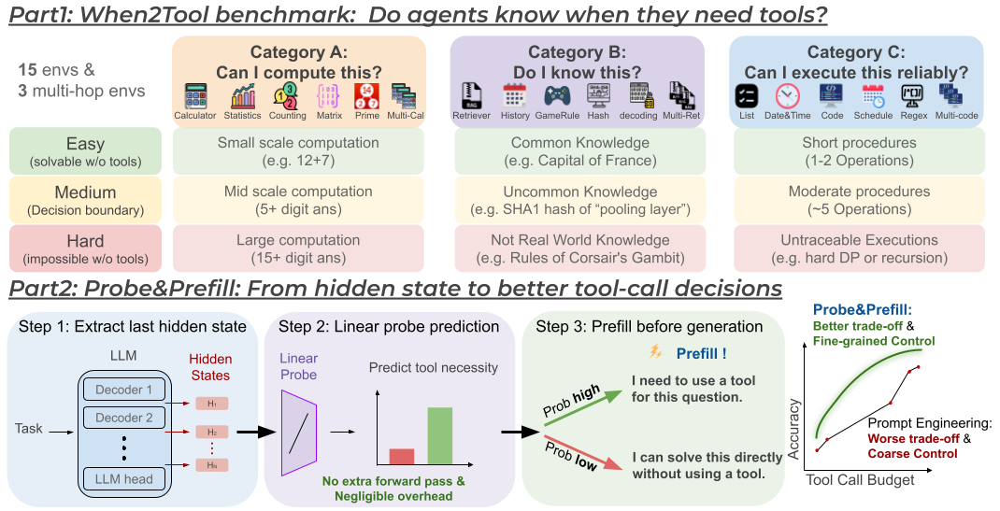

# When2Tool

Official repository for [**LLM Agents Already Know When to Call Tools — Even Without Reasoning**](https://arxiv.org/abs/2605.09252).

[[Paper]](https://arxiv.org/abs/2605.09252) | [[Project Page]](https://lilywenglab.github.io/when2tool/) | [[Dataset]](https://huggingface.co/datasets/cesun/When2Tool)

<p align="center">
  
</p>

## Overview

Tool-augmented LLM agents tend to call tools indiscriminately, even when the model can answer directly. We design **When2Tool**, a benchmark to study this problem, show that prompt engineering and reasoning both fail, and propose **Probe&Prefill** — a lightweight method that reads the model's hidden states to make better tool-call decisions.

Key results:
- Linear probes on hidden states achieve AUROC 0.89–0.96 for predicting tool necessity
- Probe&Prefill reduces tool calls by 48% with only 1.7% accuracy loss
- No fine-tuning, no reasoning tokens, <1ms overhead

## Quick Start

### Installation

```bash
git clone https://github.com/Trustworthy-ML-Lab/when2tool.git
cd when2tool
pip install -r requirements.txt
```

### Data

Our benchmark **When2Tool** is available on HuggingFace: [cesun/When2Tool](https://huggingface.co/datasets/cesun/When2Tool).

All scripts automatically download the dataset from HuggingFace if local data is not present — no manual setup needed. If local data files exist (in `data/`), they are used instead.

To generate data locally (optional, deterministic):
```bash
bash generate_data.sh
```

Dataset summary:
- `tasks_v1_train.json` — 900 training tasks (15 envs × 3 difficulties × 20 tasks)
- `tasks_v1_test.json` — 2,250 test tasks (15 envs × 3 difficulties × 50 tasks)
- `tasks_v1_multihop_train.json` — 180 multi-hop training tasks
- `tasks_v1_multihop_test.json` — 450 multi-hop test tasks

You can also load the dataset directly in Python:
```python
from datasets import load_dataset

ds = load_dataset("cesun/When2Tool", "single_hop")  # train/test splits
ds_mh = load_dataset("cesun/When2Tool", "multi_hop")
```

### One-Command Pipeline

Run the full pipeline for a single model:

```bash
./run_pipeline.sh qwen3-4b-instruct
```

This executes 5 steps end-to-end:
1. **Baseline evaluation** — Run all prompt modes (Force/Default/Necessary/Sparse/NoTool) with and without Reason-then-Act
2. **Feature extraction** — Extract hidden states at the last token position from a standard forward pass; label each task as tool-necessary or tool-unnecessary
3. **Probe training** — Train a linear probe (logistic regression) on hidden states to predict tool necessity
4. **Probe&Prefill** — At inference, use the probe to decide per-task whether to prefill "I can solve this directly" or "I need a tool", then let the model generate from there (sweep threshold τ=0.1–0.9)
5. **Plot** — Generate accuracy vs. total tool calls figure

### Supported Models

| Alias | HuggingFace Path |
|-------|-----------------|
| `qwen3-1.7b` | Qwen/Qwen3-1.7B |
| `qwen3-4b-instruct` | Qwen/Qwen3-4B-Instruct-2507 |
| `qwen3-14b` | Qwen/Qwen3-14B |
| `qwen3-32b` | Qwen/Qwen3-32B |
| `llama3.1-8b` | meta-llama/Llama-3.1-8B-Instruct |
| `llama3.3-70b` | meta-llama/Llama-3.3-70B-Instruct |

Run all models (default if no model specified):
```bash
./run_pipeline.sh
```

## Pipeline Steps

The pipeline (`run_pipeline.sh`) executes 5 steps in sequence. You can run specific steps with `--steps`:

```bash
./run_pipeline.sh --steps 1,2 qwen3-4b-instruct   # only steps 1 & 2
./run_pipeline.sh --steps 4,5 qwen3-4b-instruct   # only probe eval + plot
```

### Step 1: Baseline Evaluation

Evaluates all prompt modes (Force, Default, Necessary, Sparse, No Tool) × reasoning modes (with/without reasoning).

```bash
python src/run_eval.py \
  --model_path qwen3-4b-instruct \
  --data_path ./data/tasks_v1_test.json \
  --prompt_mode current \
  --reasoning_mode no_reasoning \
  --output_path ./outputs/qwen3-4b-instruct/current__no_reasoning.json \
  --n_runs 3
```

**Prompt modes:**
- `force_tool` (F): Tool use is mandatory
- `current` (D/★): Default — model can choose freely
- `necessary_tool` (N): Use tools only if necessary
- `sparse_tool` (S): Tool calls are expensive, default to zero
- `no_tool` (X): Do not use any tools

**Reasoning modes:**
- `no_reasoning`: Direct action (Prompt-only baseline)
- `reasoning`: Model reasons about tool necessity before acting (Reason-then-Act baseline)

### Step 2: Extract Features

Runs two phases: (1) no-tool evaluation to get ground-truth labels (tool_necessary = 1 if task fails without tools), (2) hidden state extraction from the standard forward pass.

```bash
python src/extract_features.py \
  --model_path qwen3-4b-instruct \
  --output_dir ./probe_data/qwen3-4b-instruct \
  --data_path ./data/tasks_v1_train.json \
  --data_path_test ./data/tasks_v1_test.json
```

Outputs:
- `probe_data/{model}/test_hidden_no_reasoning.pt` — hidden states (n_tasks × n_layers × hidden_dim)
- `probe_data/{model}/test_labels_no_reasoning.json` — per-task labels and metadata

### Step 3: Train Probe

Trains an L2-regularized logistic regression on all-layer concatenated hidden states.

```bash
python src/train_probe.py \
  --data_dir ./probe_data/qwen3-4b-instruct \
  --mode no_reasoning \
  --reg 10000 \
  --all_layers
```

Outputs:
- `probe_data/{model}/probe_no_reasoning.pt` — trained probe weights + scaler

### Step 4: Probe-Guided Evaluation (Probe&Prefill)

Applies the trained probe at inference time. For each task: predict P(tool_necessary), threshold with τ, and prefill the response with a steering sentence.

```bash
python src/run_probe_eval.py \
  --model_path qwen3-4b-instruct \
  --probe_dir ./probe_data/qwen3-4b-instruct \
  --data_path ./data/tasks_v1_test.json \
  --threshold 0.5 \
  --temperature 2.0 \
  --prefill_mode soft \
  --output_dir ./outputs/qwen3-4b-instruct \
  --n_runs 3
```

**Prefill modes:**
- `soft`: Prepends a natural language steering sentence (model can override)
  - Tool unnecessary: *"I can solve this directly without using a tool."*
  - Tool necessary: *"I need to use a tool for this question."*
- `hard`: Forces output format directly (no override possible)
  - Tool unnecessary: `\boxed{`
  - Tool necessary: `<tool_call>\n` or `{"name": "`

Llama models require `hard` prefill because they partially ignore soft steering.

### Step 5: Plot Results

Generates a paper-quality accuracy vs. total tool calls figure.

```bash
python src/plot_figures.py \
  --models qwen3-4b-instruct \
  --data_path ./data/tasks_v1_test.json \
  --output ./figures/qwen3-4b-instruct_tradeoff.pdf
```

Plot multiple models side by side:
```bash
python src/plot_figures.py \
  --models qwen3-1.7b qwen3-4b-instruct qwen3-14b qwen3-32b llama3.1-8b llama3.3-70b \
  --output ./figures/all_models.pdf
```

## Multi-Hop Evaluation

The multi-hop pipeline evaluates 3-step tool-call chains. It reuses the single-hop probe (transfer without retraining):

```bash
./run_multihop_pipeline.sh qwen3-4b-instruct
```

## Project Structure

```
.
├── run_pipeline.sh          # Full single-hop pipeline (one command)
├── run_multihop_pipeline.sh # Full multi-hop pipeline
├── run_all_settings.sh      # Grid runner for Step 1 (called by pipeline)
├── generate_data.sh         # Data generation script
├── requirements.txt
├── src/
│   ├── run_eval.py          # Step 1: Baseline evaluation
│   ├── extract_features.py  # Step 2: Hidden state extraction + labels
│   ├── train_probe.py       # Step 3: Linear probe training
│   ├── run_probe_eval.py    # Step 4: Probe&Prefill inference
│   ├── plot_figures.py      # Step 5: Tradeoff figures
│   ├── eval_probe_transfer.py  # Transfer probe to multi-hop
│   ├── model.py             # AgentModel wrapper (vLLM/HF backends)
│   ├── utils.py             # Prompts, evaluation loop, metrics, HF data loading
│   └── summarize_settings.py   # Optional: generate comparison tables
├── envs/                    # 15 sandboxed tool environments
├── data/                    # Benchmark task JSONs (auto-downloaded from HF)
└── data_generators/         # Task generation scripts (optional local generation)
```

## Citation

```bibtex
@article{sun2026when2tool,
  title={LLM Agents Already Know When to Call Tools -- Even Without Reasoning},
  author={Sun, Chung-En and Liu, Linbo and Yan, Ge and Wang, Zimo and Weng, Tsui-Wei},
  journal={arXiv preprint arXiv:2605.09252},
  year={2026},
  url={https://arxiv.org/abs/2605.09252}
}
```
